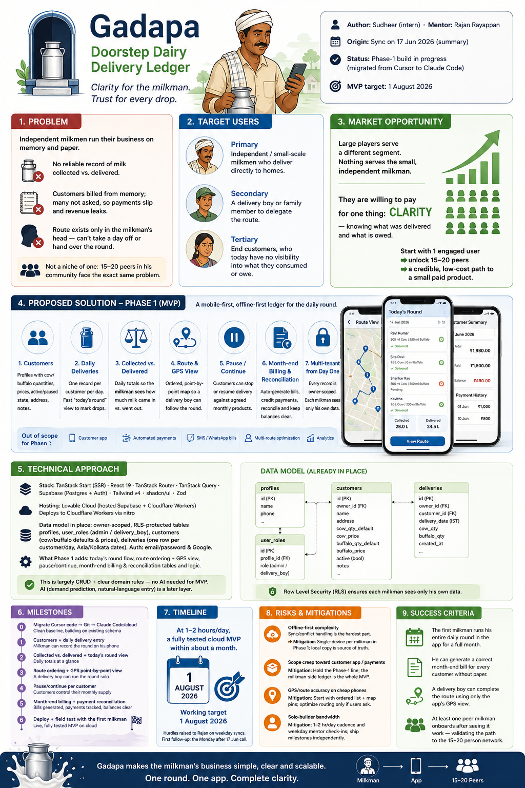
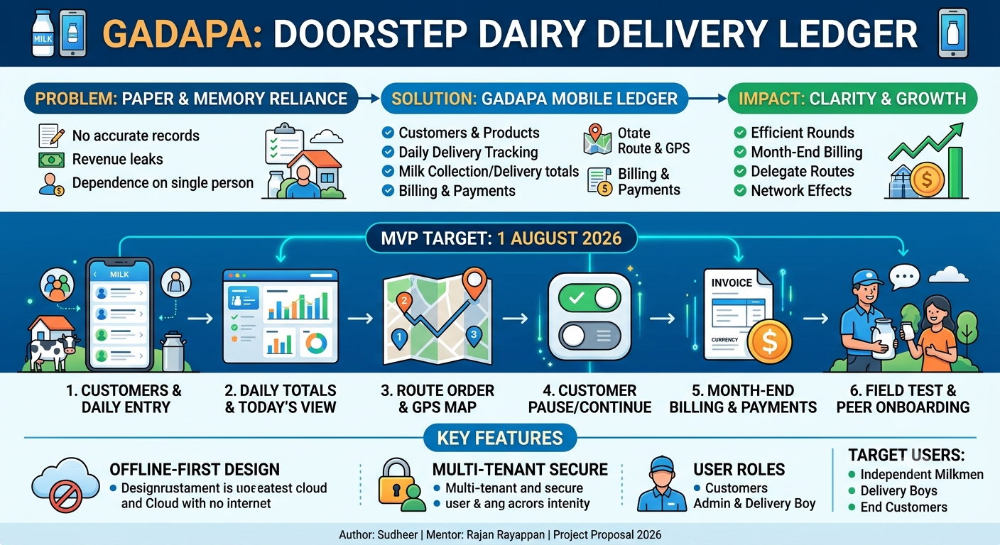

# Project Proposal — Gadapa: Doorstep Dairy Delivery Ledger

- **Author:** Sudheer (intern) · **Mentor:** Rajan Rayappan
- **Origin:** Sync on 17 Jun 2026 ([summary](../000-meetings/2026-06-17-teams/summary.md))
- **Status:** Phase-1 build in progress (migrated from Cursor to Claude Code)
- **MVP target:** 1 August 2026

---

## 1. Problem

Independent milkmen run their entire business on memory and paper. The supplier
Sudheer works with wakes at 3 AM daily, delivers along a route from his own
cattle, and tracks who got how much milk — and who owes what — entirely in his
head. The result:

- No reliable record of milk **collected vs. delivered** each day.
- Customers are billed from memory at month-end; many are never asked at all, so
  payments slip and revenue leaks.
- The route lives only in the milkman's head — he can't take a day off or hand
  the round to a delivery boy without losing track.

This is not a niche of one. The milkman has **15–20 peers in his community** with
the exact same problem.

## 2. Target users

- **Primary:** independent / small-scale milkmen who deliver directly to homes.
- **Secondary:** a delivery boy or family member the milkman wants to delegate
  the route to.
- **Tertiary:** the end customers, who today have no visibility into what they
  consumed or owe.

## 3. Market opportunity

Large players (Milk Basket and similar) serve a different segment and try to
deliver everything. **Nothing on the market serves the small, independent
milkman.** These milkmen are willing to pay for one thing: *clarity* — knowing
what was delivered and what is owed. Starting with one engaged user who has a
ready network of 15–20 peers gives a credible, low-cost path from a single
working app to a small paid product.

## 4. Proposed solution — Phase 1 (MVP)

A mobile-first, **offline-first** ledger (the route works even when the network
doesn't) that the milkman uses on his phone during the round. Scope for the
first phase:

1. **Customers** — per-customer profile with default cow/buffalo quantities and
   prices, active/paused state, address, and notes.
2. **Daily deliveries** — one record per customer per day capturing cow and
   buffalo quantities; a fast "today's round" view to mark drops as they happen.
3. **Collected vs. delivered** — daily totals so the milkman sees how much milk
   came in versus went out.
4. **Route & GPS view** — an ordered, point-by-point map of customer locations
   so a delivery boy can follow the round without the milkman present.
5. **Pause / continue** — customers can stop or resume delivery against the
   products they've agreed for the month.
6. **Month-end billing & reconciliation** — auto-generate each customer's
   monthly bill; when paid, credit it to the milkman's account and reconcile
   against payments so balances are always clear.
7. **Multi-tenant from day one** — every record is owner-scoped so each milkman
   sees only his own customers, deliveries, and books.

Out of scope for Phase 1 (later): customer-facing app, automated payment
collection, SMS/WhatsApp bill delivery, multi-route optimization, analytics.

## 5. Technical approach

The codebase already exists and is being built on (not started from scratch):

- **Stack:** TanStack Start (full-stack SSR) · React 19 · TanStack Router ·
  TanStack Query · Supabase (Postgres + Auth) · Tailwind v4 · shadcn/ui · Zod.
- **Hosting:** Lovable Cloud (hosted Supabase + Cloudflare Workers); deploys to
  Cloudflare Workers via nitro.
- **Data model already in place:** owner-scoped, RLS-protected `profiles`,
  `user_roles` (admin / delivery_boy), `customers` (cow/buffalo default
  quantities and prices, active flag), and `deliveries` (one row per
  customer/day, Asia/Kolkata dates). Auth supports email/password and Google.
- **What Phase 1 adds:** the "today's round" delivery flow, route ordering + GPS
  view, pause/continue, and the month-end billing/reconciliation tables and
  logic.

This is largely **CRUD plus clear domain rules** — deliberately so. No AI is
needed to make the MVP valuable; clarity and reliability are the product. (AI —
e.g. demand prediction or natural-language entry — is a credible *later* layer,
not an MVP requirement.)

## 6. Milestones

| # | Milestone | Outcome |
| --- | --- | --- |
| 0 | Migrate Cursor code → Git → Claude Code/cloud | Clean baseline, building on existing schema |
| 1 | Customers + daily delivery entry | Milkman can record the round on his phone |
| 2 | Collected vs. delivered + today's round view | Daily totals at a glance |
| 3 | Route ordering + GPS point-by-point view | A delivery boy can run the round solo |
| 4 | Pause/continue per customer | Customers control their monthly supply |
| 5 | Month-end billing + payment reconciliation | Bills generated, payments tracked, balances clear |
| 6 | Deploy + field test with the first milkman | Live, fully tested MVP on cloud |

## 7. Timeline

At **1–2 hours/day**, the estimate from the sync is a **fully tested cloud MVP
within about a month**. Working target: **1 August 2026**. Hurdles get raised to
Rajan on weekday syncs (the first follow-up is the Monday after the 17 Jun call).

## 8. Risks & mitigations

- **Offline-first complexity** — sync/conflict handling is the hardest part.
  *Mitigation:* keep Phase 1 single-device per milkman; treat the local copy as
  source of truth and sync up when online.
- **Scope creep toward a customer app / payments** — *Mitigation:* hold the
  Phase-1 line above; the milkman-side ledger is the whole MVP.
- **GPS/route accuracy on cheap phones** — *Mitigation:* start with a simple
  ordered list + map pins; optimize routing only if users ask.
- **Solo-builder bandwidth** — *Mitigation:* the 1–2 hr/day cadence and weekday
  mentor check-ins; ship milestones independently.

## 9. Success criteria

- The first milkman runs his **entire daily round** in the app for a full month.
- He can generate a correct **month-end bill** for every customer without paper.
- A delivery boy can complete the route **using only the app's GPS view**.
- At least **one peer milkman** onboards after seeing it work — validating the
  path to the 15–20 person network.

---

## Appendix — Visuals

